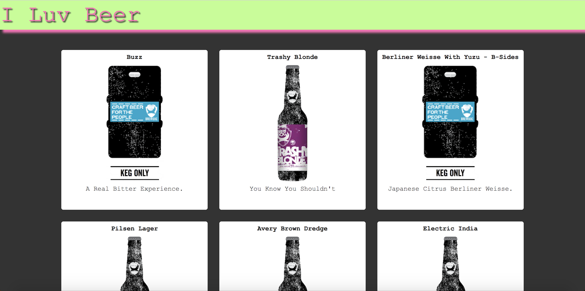

# API Meetup

## Desription

A project for a meetup where beginners can build an application using an API and less than 50 lines of Javascript!  Meetup details coming soon!

[Deployed Link](https://i-luv-beer.firebaseapp.com/)

## Getting Started

1. Click [here](https://i-luv-beer.firebaseapp.com/).
2. Click on a beer card of your choice.
3. Learn about this beer!
4. Click here for a [video](https://www.youtube.com/watch?v=RVRoDKc7ORs) demo.

## Technologies

Built with Vanilla JavaScript, HTML, and CSS

## License

See MIT License

### Created by Coleman Imhoff
[LinkedIn](https://www.linkedin.com/in/colemanimhoff/)
colemanimhoff@gmail.com

